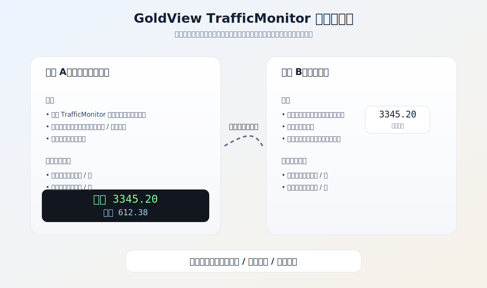
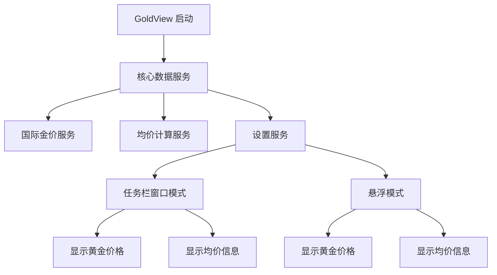
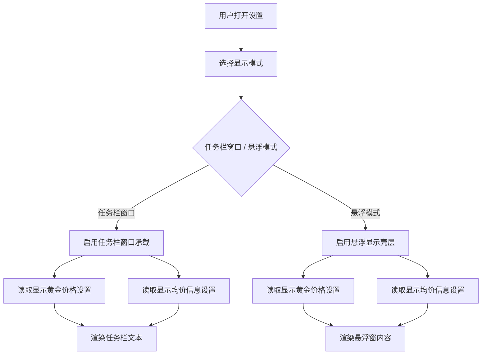
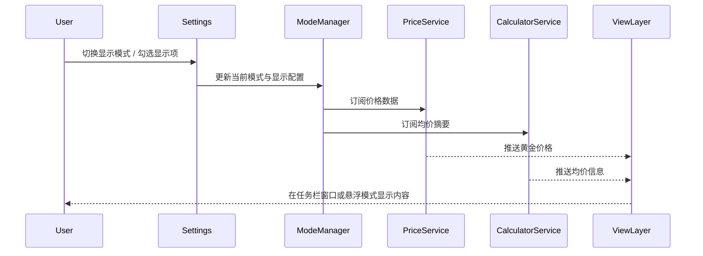
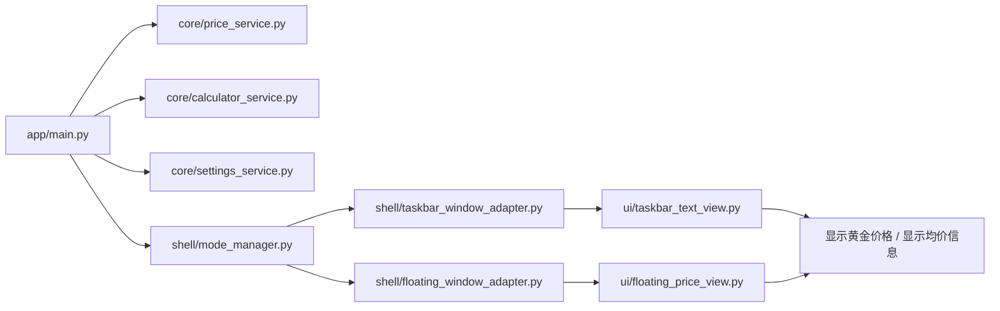

# GoldView TrafficMonitor 双模式重构方案

## 1. 方案确认

本方案基于你已经确认的方向：

- 任务栏窗口模式使用 TrafficMonitor 这一类成熟方案来承载
- 同时保留悬浮模式
- 两种模式可以切换
- 当前优先实现：
  - 设置中控制“显示黄金价格”
  - 设置中控制“显示均价信息”

这意味着 GoldView 不再自己硬啃“伪嵌入任务栏数字条”的不稳定路线，而是改为：

- **任务栏窗口模式**：复用 TrafficMonitor 已验证过的任务栏显示能力
- **悬浮模式**：作为独立的轻量显示方式
- **统一核心服务**：价格获取、均价计算、设置存储只保留一套

## 2. 新目标形态

GoldView 将演进为一个双模式桌面工具：

### 模式 A：任务栏窗口模式

- 由 TrafficMonitor 风格的任务栏窗口承载实时文本
- 显示国际金价
- 可选显示均价结果或均价摘要
- 用户在任务栏中直接看到内容

### 模式 B：悬浮模式

- 以轻量悬浮窗显示国际金价
- 可保持置顶、贴边或简洁停靠
- 适合作为备用展示方式

### 模式切换

- 用户可在设置中切换当前模式
- 两个模式共用同一套数据源和计算逻辑

## 3. 为什么采用 TrafficMonitor 路线

TrafficMonitor 的价值在于：

- 已经验证过“任务栏窗口”这类显示方式的可行性
- 在任务栏显示文本、数字、状态这件事上更成熟
- 比我们自己从零造任务栏承载层风险更低

对 GoldView 来说，关键不是把 TrafficMonitor 完整照搬，而是借鉴它的任务栏窗口承载思路。

## 4. 产品结构调整

## 5. 核心需求设计

### 5.1 必须保留

- 国际金价实时显示
- 均价计算器功能
- 历史记录
- 主接口 + 备用接口
- 轻量运行

### 5.2 当前优先级最高

先做设置中的两个控制项：

1. 是否显示黄金价格
2. 是否显示均价信息

这两个设置必须同时作用于：

- 任务栏窗口模式
- 悬浮模式

## 6. 双模式功能矩阵

| 功能 | 任务栏窗口模式 | 悬浮模式 |
|---|---|---|
| 国际金价显示 | 支持 | 支持 |
| 均价摘要显示 | 支持 | 支持 |
| 完整均价计算器 | 入口支持 | 入口支持 |
| 右键菜单 | 支持 | 支持 |
| 设置面板 | 支持 | 支持 |
| 轻量化运行 | 强 | 中 |

## 7. 设置设计

### 7.1 基础显示设置

建议先实现以下设置项：

- `显示模式`
  - 任务栏窗口
  - 悬浮模式

- `显示黄金价格`
  - 开
  - 关

- `显示均价信息`
  - 开
  - 关

- `刷新频率`
  - 0.5 秒
  - 1 秒
  - 2 秒

### 7.2 后续可加设置

- 字体大小
- 显示精度
- 涨跌颜色
- 悬浮窗位置
- 是否开机启动

## 8. 需求流程图

## 9. 交互设计图

## 10. 推荐架构

## 11. 模块职责

### 11.1 Price Service

职责：

- 获取国际金价
- 提供统一数据模型
- 处理主备接口与异常回退

### 11.2 Calculator Service

职责：

- 计算均价
- 提供均价摘要文本
- 向任务栏窗口和悬浮模式输出统一结果

### 11.3 Settings Service

职责：

- 保存当前显示模式
- 保存“显示黄金价格”
- 保存“显示均价信息”
- 保存刷新频率

### 11.4 Mode Manager

职责：

- 决定当前启用任务栏窗口还是悬浮模式
- 统一协调视图切换
- 保证模式切换时不丢数据状态

## 12. 当前阶段实施范围

本轮先不要一下子把所有东西做满，建议实施顺序如下：

### 第一阶段

- 输出方案文档
- 输出双模式示意图
- 明确设置项

### 第二阶段

- 抽离设置服务
- 抽离价格服务
- 抽离均价摘要输出

### 第三阶段

- 先接任务栏窗口模式
- 让它支持“黄金价格 / 均价信息”两个显示开关

### 第四阶段

- 再接悬浮模式
- 保证两种模式切换稳定

## 13. 风险说明

### 13.1 TrafficMonitor 方案集成风险

- 需要研究其任务栏窗口显示机制
- 不一定能直接复用全部代码
- 很可能需要“借鉴思路 + 重写适配层”

### 13.2 双模式一致性风险

- 两个模式显示逻辑容易分叉
- 所以必须把价格、均价、设置统一收口到核心服务

### 13.3 设置优先级风险

- 如果设置设计得太散，后续会难维护
- 所以第一批设置只做最关键的两个显示开关

## 14. 验收标准

满足以下条件，就说明这个新方案方向是对的：

- 用户可以在设置中切换“任务栏窗口模式 / 悬浮模式”
- 两种模式都能显示国际金价
- 两种模式都能按设置决定是否显示均价信息
- 均价计算器功能没有丢
- 整体架构不再把所有逻辑塞进一个文件

## 15. 下一步建议

如果这份设计图你确认没问题，下一步就不要再讨论展示形式了，而是直接进入实现：

1. 先重构 `core`
2. 先落设置服务
3. 先实现“显示黄金价格 / 显示均价信息”两个设置项
4. 再接任务栏窗口模式
5. 最后补悬浮模式切换
