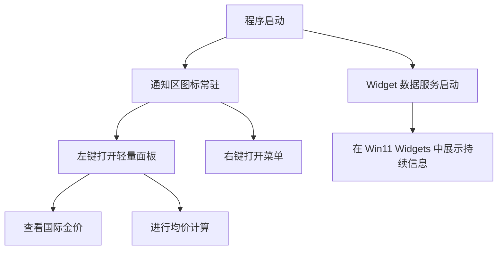
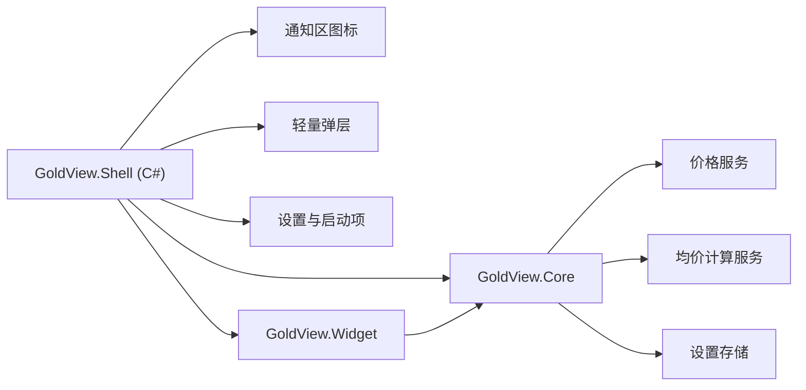

# GoldView Win11 原生稳定方案评估

## 1. 文档目的

本文件用于回答一个更严格的问题：

> 能不能通过技术架构调整、换语言、换壳层等方式，尽量避免数字条方案中的闪烁、遮挡、失焦、层级冲突问题，同时还能保持产品足够好用？

结论先说：

- **如果仍坚持“任务栏右侧持续数字条”这一视觉形态，就无法 100% 消灭这些问题**
- **如果目标改为“稳定优先、原生优先、体验尽量顺手”，则可以通过改变产品形态，大幅减少这些问题**

## 2. 核心判断

要避免旧方案的问题，不能只换语言，必须同时改变下面至少一项：

- 显示形态
- 宿主能力
- 系统集成方式

也就是说：

- Python 改成 C#，但仍做“顶层数字条小窗”，问题不会消失，只会变得更可控
- C++ 改写成 Win32 原生，如果仍是“伪嵌入数字条”，问题也不会完全消失
- 只有改成“系统原生承载的显示形态”，才能明显降低这些问题

## 3. 候选技术路线

### 路线 A：继续 Python + 数字条伪嵌入

形态：

- Python
- 顶层透明小窗
- 贴住任务栏右侧

优点：

- 改动最少
- 开发快
- 最接近你想要的截图效果

缺点：

- 闪烁和遮挡问题无法根除
- 多屏、DPI、全屏兼容压力大
- PyQt 对 Windows 壳层细节控制有限

技术难度：中  
开发难度：中  
稳定性：中下

### 路线 B：C# WPF / WinUI 3 + 数字条伪嵌入

形态：

- C#/.NET 8
- 原生 Windows UI 壳层
- 顶层数字条窗口

优点：

- Windows API 接入更自然
- DPI、多屏、窗口消息处理更方便
- 打包和启动体验比 Python 更适合作为 Windows 常驻工具

缺点：

- 只要还是“数字条伪嵌入”，系统级问题仍存在
- 需要重写 UI 壳层

技术难度：中  
开发难度：中高  
稳定性：中

### 路线 C：C++ Win32 原生数字条

形态：

- C++ Win32
- 极薄原生窗口
- 自绘数字条

优点：

- 对窗口样式、消息循环、DPI、定位控制最强
- 运行时最轻

缺点：

- 开发复杂度最高
- 维护成本很高
- 即使这样，也依然不能把“伪嵌入”变成“原生任务栏文字槽位”

技术难度：高  
开发难度：很高  
稳定性：中上

### 路线 D：C# + Windows Widgets + 通知区宿主

形态：

- C# / Windows App SDK
- 使用 Windows Widgets 提供持续信息展示
- 使用通知区图标和轻量弹层做快速入口

优点：

- Widget 由系统宿主承载，不依赖顶层伪嵌入
- 不会出现数字条与任务栏抢层级的问题
- 通知区图标与弹层是官方长期支持的桌面入口
- 稳定性显著高于数字条方案

缺点：

- Widget 不在任务栏右侧常亮
- 视觉上不像你最初截图那样直接挂在任务栏边上
- 开发模式与当前仓库差异较大

技术难度：中高  
开发难度：高  
稳定性：高

## 4. 新推荐方案

## 4.1 主方案结论

如果目标是：

- 尽量避免闪烁
- 尽量避免被任务栏遮挡
- 尽量降低焦点切换带来的异常
- 产品依然好用

那么推荐的新主方案是：

**C#/.NET 8 原生壳层 + 通知区主入口 + 轻量弹层 + Win11 Widget 补充展示**

这份方案的核心思想是：

- 放弃“任务栏右侧持续数字条”作为默认主形态
- 改为系统支持更好的原生入口
- 让“持续信息展示”放到 Widget
- 让“快速操作入口”放到通知区图标与弹层

## 4.2 为什么这个方案更稳

这个方案避免了旧方案最危险的点：

- 不再依赖顶层伪嵌入数字条
- 不再和任务栏直接抢视觉层级
- 不再把常驻显示建立在一个贴边透明小窗上

所以它天然规避的问题包括：

- 点击其他应用后数字条闪烁
- 被任务栏覆盖
- 自动隐藏任务栏冲突
- 全屏应用时的异常遮挡

## 5. 新主方案的产品形态

### 用户看到的体验

- 右下角通知区有 GoldView 图标
- 鼠标点击图标，弹出一个极轻的小面板
- 面板中可以查看国际金价与均价计算
- 如果用户需要持续盯盘，则把 GoldView Widget 固定到 Windows Widgets 面板

## 6. 新主方案的架构设计

推荐拆分：

- `GoldView.Core`
  - 价格抓取
  - 数据模型
  - 均价计算
  - 设置存储

- `GoldView.Shell`
  - 通知区图标
  - 轻量弹层
  - 右键菜单
  - 启动控制

- `GoldView.Widget`
  - Widget 视图模板
  - Widget 数据绑定

## 7. 是否还保留旧数字条方案

保留，但角色要变：

- **旧方案**：实验性“高仿真数字条模式”
- **新方案**：默认“稳定性优先原生模式”

也就是：

- 默认安装后先用稳定主方案
- 设置里可以开启实验性数字条模式
- 只把数字条作为增强选项，不再当主路线

## 8. 技术与开发难度评估

### 方案对比表

| 方案 | 技术难度 | 开发难度 | 稳定性 | 是否接近截图效果 | 是否推荐做主方案 |
|---|---|---|---|---|---|
| Python + PyQt 数字条 | 中 | 中 | 中下 | 高 | 否 |
| C# WPF/WinUI 数字条 | 中 | 中高 | 中 | 高 | 否 |
| C++ Win32 数字条 | 高 | 很高 | 中上 | 高 | 否 |
| C# + 通知区 + Widget | 中高 | 高 | 高 | 中 | 是 |

## 9. 为什么“换语言”不能单独解决问题

原因很简单：

- 闪烁问题不是 Python 独有
- 遮挡问题不是 PyQt 独有
- 焦点冲突也不是 Java、Go、C# 就能自然消失

真正决定问题上限的是：

- 你是否仍在做“顶层小窗伪嵌入”
- 你是否在和系统任务栏直接抢展示层

语言只会影响：

- 控制力
- 开发效率
- 打包体积
- 维护成本

不会改变这个能力边界本身。

## 10. 推荐落地顺序

1. 先冻结旧数字条方案为“实验性设计”  
2. 重新规划 `Core` 业务层  
3. 用 C#/.NET 8 实现通知区主入口与轻量弹层  
4. 再补 Win11 Widget 展示  
5. 最后决定是否保留数字条实验模式  

## 11. 最终建议

如果你问我：

> 想尽量不出现那些闪烁、遮挡、失焦问题，又要足够好用，应该选什么？

我的建议是：

**主方案改为 C#/.NET 8 原生壳层 + 通知区轻量弹层 + Win11 Widget 展示。**  

旧数字条方案继续保留，但只作为：

- 实验模式
- 可选增强模式
- 后续再决定是否继续投入

这样做最现实，也最接近“好用”和“可长期维护”的平衡点。
