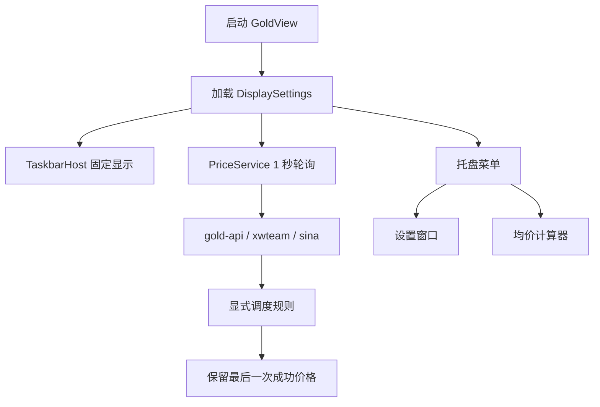

# Project Spec

## Goal

GoldView 是一个面向 Windows 桌面的原生伦敦金价格查看工具。

`v3.5.0` 的目标是：

- 启动后固定显示在主屏任务栏左侧
- 运行时维持原生 `Win32/C++` 单主线
- 价格更新改为 `1 秒请求一次`
- 在公开免费源条件下，尽量做到 `2-3 秒` 出现一次有效新价
- 托盘菜单提供 `设置 / 均价计算器 / 退出`
- 通过独立设置窗口提供数据更新设置与显示设置
- 任务栏主显示仍以黄金价格数值为核心

## Tech Stack

- 运行时：Win32 API
- 语言：C++17
- 网络：WinHTTP
- 构建：CMake + `native/build_native.bat`
- 持久化：INI 配置文件
- 历史参考：Python / PyQt，仅保留在 `legacy/`

## Directory Structure

- `native/`
  原生主线实现，包含应用入口、任务栏宿主、设置窗口、价格服务、计算器与持久化
- `native/include/`
  原生头文件与领域模型
- `native/src/`
  原生实现代码
- `legacy/`
  历史 PyQt 参考实现，不参与当前运行时
- `docs/`
  产品说明、技术说明与任务规范
- `docs/tasks/task.md`
  任务状态账本

## Naming Conventions

- C++ 类型使用 `PascalCase`
- 变量与函数使用 `camelCase`
- 常量使用 `kCamelCase` 或 `SNAKE_CASE`
- 文档文件优先使用中文命名
- 对外产品名称统一为 `GoldView`

## State Conventions

- `docs/tasks/task.md` 是唯一任务状态账本
- `### [vX.Y.Z] 对话 + YYYY-MM-DD` 表示唯一活动锚点
- `## [vX.Y.Z] 对话 + YYYY-MM-DD` 表示归档锚点
- 当前活动版本目标为 `v3.5.0`

## Execution Constraints

- 主线只在原生 `Win32/C++` 上继续推进
- 历史 `price_service.py` 只作候选 API 与行为参考，不回迁运行时
- 只接入公开免费源，不引入付费源或 API key 源
- 价格服务固定 `1 秒` 请求一次，不再暴露刷新频率设置
- 自动调度规则必须显式可解释，不使用模糊“智能打分”替代核心切换条件
- 任务栏稳定性优先于显示自由度，对危险显示设置做限制而非完全开放

## Verification Strategy

- 原生构建验证
- 程序最小启动验证
- benchmark 采样验证
- 调度切源验证
- 设置窗口即时刷新与持久化验证
- 计算器回归验证

## Backup and Rollback

- 优先局部补丁修改，避免整文件覆盖历史状态
- 文档与代码口径同步更新，避免出现旧版本策略残留
- 如后续需要大范围重构价格服务或设置窗口，先保留 `v3.5.0` 快照



```svg
<svg xmlns="http://www.w3.org/2000/svg" viewBox="0 0 560 190">
  <rect x="18" y="18" width="150" height="58" rx="14" fill="#1f2937" stroke="#111827" stroke-width="2"/>
  <text x="44" y="54" font-size="24" font-family="Segoe UI, Arial, sans-serif" fill="#f8fafc">GoldView</text>
  <rect x="196" y="18" width="156" height="58" rx="14" fill="#fff7db" stroke="#c28a10" stroke-width="2"/>
  <text x="216" y="53" font-size="18" font-family="Segoe UI, Arial, sans-serif" fill="#7c5400">1 秒请求一次</text>
  <rect x="380" y="18" width="162" height="58" rx="14" fill="#eef6f2" stroke="#24543b" stroke-width="2"/>
  <text x="398" y="53" font-size="18" font-family="Segoe UI, Arial, sans-serif" fill="#24543b">目标 2-3 秒新价</text>
  <path d="M168 47 H196" stroke="#64748b" stroke-width="2.5" fill="none"/>
  <path d="M352 47 H380" stroke="#64748b" stroke-width="2.5" fill="none"/>
  <rect x="92" y="108" width="374" height="56" rx="14" fill="#f8fafc" stroke="#94a3b8" stroke-width="2"/>
  <text x="118" y="142" font-size="18" font-family="Segoe UI, Arial, sans-serif" fill="#0f172a">设置窗口 + 多源调度 + 任务栏显示配置</text>
</svg>
```
